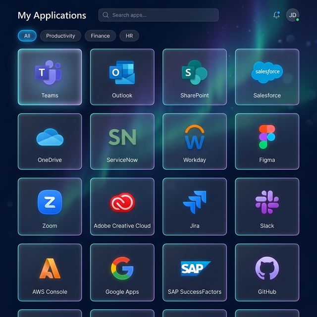
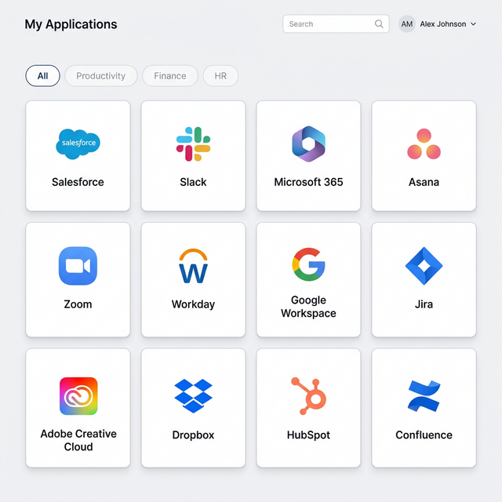
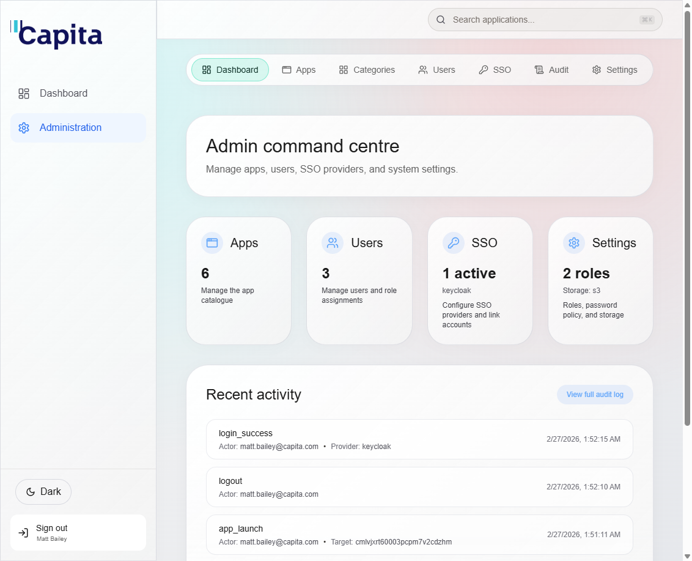
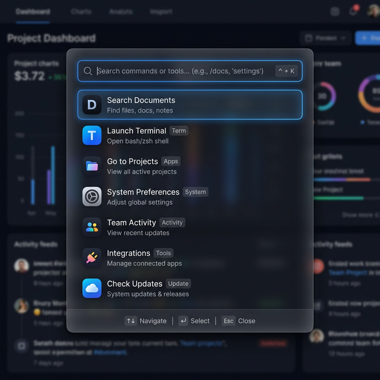
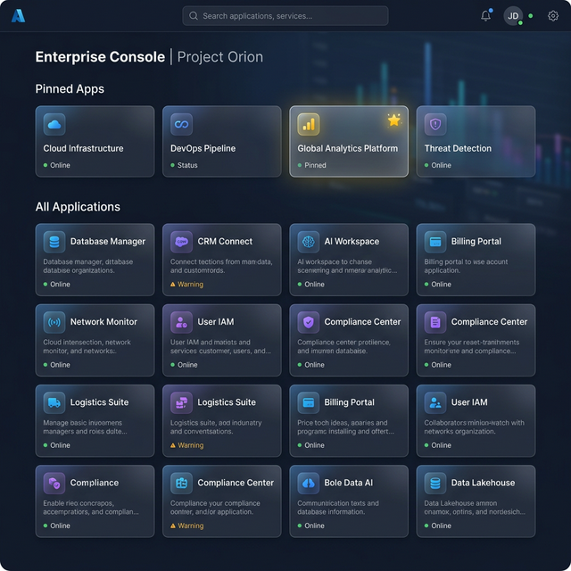
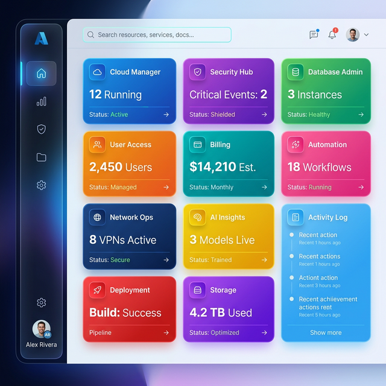
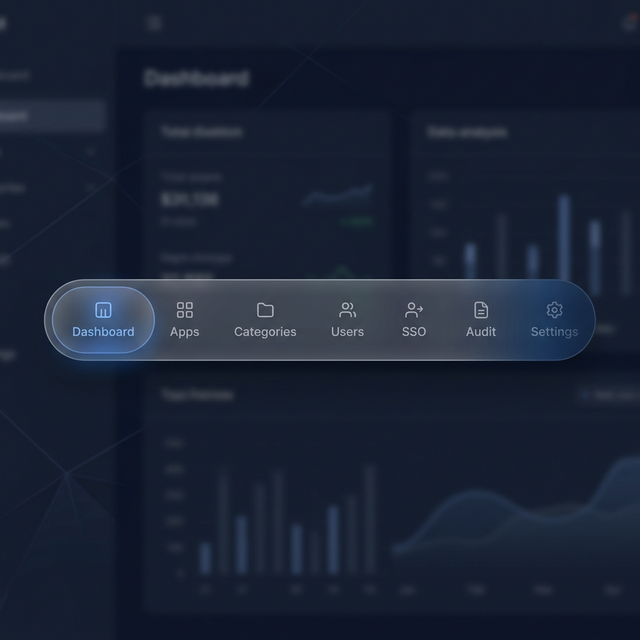

# TechHub 🚀

**TechHub** is a premium, high-performance administrative dashboard and internal application portal. Built with **Next.js**, **Prisma**, and **Docker**, it provides a centralized, secure, and visually stunning entry point for all your organization's internal tools.



[](https://nextjs.org/)
[](https://www.typescriptlang.org/)
[](https://www.docker.com/)

---

## ✨ Visual Showcase

````carousel

<!-- slide -->

<!-- slide -->

<!-- slide -->

<!-- slide -->

<!-- slide -->

<!-- slide -->

````

---

## 💎 Key Features

- **🚀 Ultra-Fast Experience**: Powered by Next.js App Router with skeleton loading and smooth transitions.
- **🔍 Command Palette (Ctrl+K)**: Instant access to apps, admin pages, and settings from anywhere.
- **📌 Personalized Dashboards**: Users can pin their most-used apps for quick access.
- **📊 Real-time Analytics**: Built-in charts and logs for tracking app popularity and system activity.
- **🎨 Dynamic Theming**: Fully optimized Light and Dark modes with glassmorphism aesthetics.
- **🛡️ Native Security**:
  - **Embedded Security Headers**: HSTS, Strict CSP, and X-Frame protection built directly into the app core.
  - **Strict Nonce-based CSP**: Forbids `'unsafe-inline'` for both scripts and styles, providing top-tier protection against XSS.
  - **SSO Integration**: Out-of-the-box support for Azure AD and Keycloak.
  - **Hardened Auth**: Robust password policies and session protection.
  - **Audit Logging**: Comprehensive trails for every administrative action.
- **☁️ Flexible Storage**: Support for Local, AWS S3, and Azure Blob storage.
- **🛠️ Admin Empowerment**: Easily manage apps, categories, users, and global site configurations (including custom logos).

---

## 🏗️ Architecture

TechHub is designed as a **Standalone Container** architecture. It is fully self-contained and ready to be deployed behind any modern cloud ingress or reverse proxy.

- **Frontend/Backend**: Next.js (React) unified App Router.
- **Database**: PostgreSQL (managed via Prisma).
- **Cache**: Redis for session management and rate limiting.
- **Security**: Hardened at the application layer; no sidecar proxy required for core safety. Fully strictly nonced CSP.

---

## 🚀 Quick Start

### 1. Requirements
- **Node.js**: 20.x (LTS) or later
- **PostgreSQL**: 13+ or later
- **Redis**: 6.2+ or later
- **Docker**: Desktop 4.x+ or Compose v2+

### 2. Initial Setup
```bash
# 1. Clone & Copy environment template
cp .env.example .env

# 2. Spin up the infrastructure
docker-compose up -d --build

# 3. Access your initial admin credentials
docker-compose logs app | grep "SEED"
```

### 3. Visit the Portal
Open `http://localhost` (or your configured `PORT`, e.g., `http://localhost:8082`).

---

## 🌩️ Production Deployment

For detailed instructions on deploying TechHub to production environments (Azure, AWS, etc.), see our [Production Deployment Guide](docs/DEPLOYMENT.md).

---

## 🛠️ Local Development

```bash
# Install dependencies
npm install

# Start development services (DB & Redis)
docker-compose up -d db redis

# Setup database
npm run prisma:generate
npm run prisma:push
npm run prisma:seed

# Start Next.js in dev mode
npm run dev
```

---

## 🤝 Contributing

We welcome contributions! Please follow our modern dev workflow:
1. Ensure `npm run lint` passes.
2. Follow the design system outlined in `globals.css`.
3. Test your changes with `npm test`.

---

Built with ❤️ by the TechHub team.
