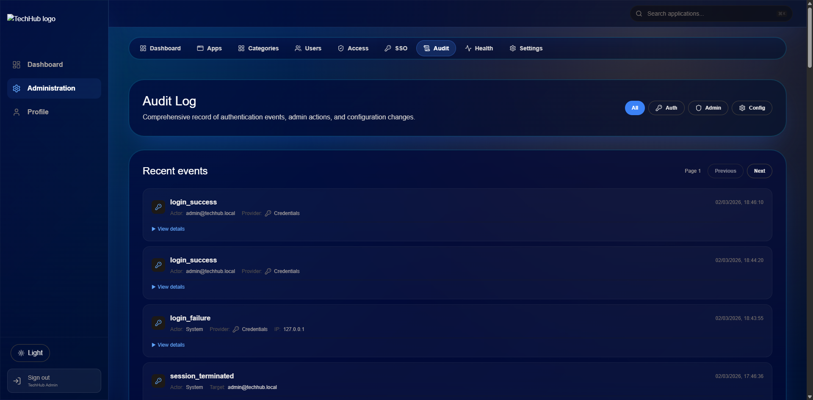

# TechHub Security & Hardening

TechHub implements a "Defense-in-Depth" strategy, ensuring that multiple security layers protect administrative integrity and user data. The application is hardened out-of-the-box for enterprise cloud deployments.

## 1. Authentication & Session Management

- **Provider Diversity**: Native support for **Azure Entra ID (SSO)**, **Keycloak**, and **Local Credentials**.
- **Must Change Password**: New local users are forced to update their credentials upon first login.
- **Session Hardening**:
  - **Absolute Timeout (8h)**: Prevents long-lived session hijacking by forcing re-authentication once per shift.
  - **Idle Timeout (20m)**: Automatically terminates sessions after 20 minutes of inactivity.
  - **Session Guard**: A specialized middleware logic that prevents rapid-fire redirection loops and ensures session consistency across administrative state changes.
- **Real-time Revocation**: Sessions are cryptographically bound to a `securityStamp` on the `User` model. This stamp is rotated during security events (e.g. password changes), ensuring immediate revocation of all active sessions across devices while allowing non-security profile updates to persist.

## 2. Infrastructure Security

### Strict Content Security Policy (CSP)
TechHub enforces a strict, nonce-based CSP via [`src/middleware.ts`](src/middleware.ts). 
- **Dynamic Nonces**: Every request generates a cryptographically secure 128-bit nonce.
- **No `'unsafe-inline'`**: All scripts and styles must be nonced, effectively neutering XSS vectors.
- **Strict Headers**: HSTS, `X-Content-Type-Options: nosniff`, and `X-Frame-Options: SAMEORIGIN` are enforced.

### SSRF Policy & DNS Rebinding Protection
Administrative features that fetch external assets or interact with storage providers are hardened against SSRF and **DNS Rebinding (TOCTOU)** attacks:
- **Pinned IP Clients**: All outgoing connections to cloud storage (S3/Azure) and SSO providers utilize a pinned HTTP client. The target hostname is resolved once, validated to be a public IP, and then the connection is "pinned" to that specific IP address for the duration of the request.
- **Internal IP Blocking**: Automatically rejects attempts to scan or access private network ranges (RFC 1918), loopback, or link-local addresses.

## 3. Request Integrity

### Signed Double-Submit CSRF Protection
TechHub implements a custom, high-security CSRF layer in [`src/lib/csrf.ts`](src/lib/csrf.ts):
- **HMAC Signatures**: CSRF tokens are cryptographically bound to the user's secret session sub.
- **Public Flow Protection**: Even unauthenticated flows (e.g., login, password reset) are protected by tokens bound to a persistent `visitor-id` cookie.
- **Timing-Safe Validation**: Uses `crypto.timingSafeEqual` to prevent side-channel attacks during token verification.

### Rate Limiting
- **Redis-Backed**: In production, rate limits are centralized in Redis to ensure consistency across multiple container instances.
- **Tiered Filtering**: Protects against automated password spraying and brute-force attacks at the IP and User levels.

## 4. Storage & Media Security

- **Path Traversal Prevention**: The `readIcon` implementation in [`src/lib/storage.ts`](src/lib/storage.ts) strictly validates path segments to prevent `../` traversal attacks.
- **SVG Security & Stored XSS Control**: 
  - **In-Memory Sanitization**: All SVG uploads are parsed and sanitized on the server before being committed to storage, stripping potentially malicious `<script>` or event handler attributes.
  - **Download-Only Policy**: SVGs are served with `Content-Disposition: attachment`. This forces the browser to treat the file as a download rather than rendering it inline, which effectively prevents any residual scripts from executing in the context of the TechHub origin.
- **Decoupled Access**: Media assets are never served directly from the filesystem. They are streamed via a proxy route ([`src/app/uploads/[...path]/route.ts`](src/app/uploads/%5B...path%5D/route.ts)) which reinforces `nosniff` headers and content-type isolation.
- **Magic-Byte Validation**: File types are determined by inspecting "Magic Bytes" (MIME sniffing) at the storage layer rather than trusting the user-supplied extension, preventing the upload of dangerous files disguised as images.

## 5. Audit & Compliance

Every security-relevant operation is recorded in the `AuditLog` table:

- **Actor**: Who performed the action (User ID or 'system').
- **Target**: The resource being modified (User ID, App ID, etc.).
- **Outcome**: Success or failure (with detailed reason).
- **Context**: Client IP and latency tracking.

> [!NOTE]
> In Azure Container Apps (ACA), the system automatically detects the client IP via `X-Azure-ClientIP`. Otherwise it falls back to a right-to-left scan of `X-Forwarded-For` against configured `TRUSTED_PROXIES`. Ensure `TRUST_PROXY=true` is set.
