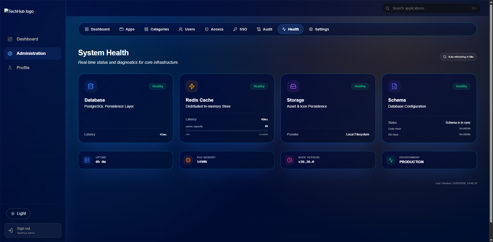

# Administrative Operations Guide

This guide provides procedures for administrative tasks, identity management, and system recovery in TechHub.

## 1. Initial Setup & Seeding

TechHub uses a seeding script (`prisma/seed.ts`) to initialize the environment with a root administrator and sample data.

### Automated First Boot
On the first container startup, the `auto-migrate.js` script will:
1. Push the database schema.
2. Check for an existing administrator.
3. If none exists, create a new admin account (`admin@techhub.local`) with a **one-time secure password** printed to the container logs.

## 2. Admin Password Recovery

If the administrator password is lost or a reset is required due to personnel change, follow these steps:

### Via Azure Container Apps (Recommended)
1. **Prepare Secrets**: Ensure the `ADMIN_PASSWORD` secret in your Key Vault (or ACA Secret) is set to the new strong password.
2. **Setup a Job**: Create a one-time **Azure Container Job** using the TechHub image.
3. **Command Override**: Replace the default startup command with:
   - **Command**: `node`
   - **Arguments**: `prisma/seed.js`
4. **Environment**: Ensure the job has access to the `DATABASE_URL` and `SSO_MASTER_KEY` environment variables.
5. **Run**: Execute the job.
6. **Result**: The script will find the existing admin by email, update their hash to match the new `ADMIN_PASSWORD`, and flip the `mustChangePassword` flag to `true`.

### Via Docker Compose (Local)
Run the following command from your host machine:
```bash
docker-compose run -e ADMIN_PASSWORD="your-new-secure-password" app node prisma/seed.js
```

## 3. Access Control & RBAC

TechHub implements a granular Role-Based Access Control system managed via the **Admin > Roles** dashboard.

- **System Roles (`admin`, `staff`)**: Core roles with predefined access.
- **App Visibility**:
  - **Public**: Visible to all users (even unauthenticated).
  - **Authenticated**: Visible to any logged-in user.
  - **Role-Based**: Visible only to users assigned specific roles.
- **User Pre-Provisioning**: If `REQUIRE_PREPROVISIONED_USERS="true"`, users must be manually added to the database (or created by an admin) before they can successfully sign in via SSO.

## 4. Troubleshooting & Maintenance

### Health Dashboard
Navigate to **Admin > Health** to monitor:



- **Database Status**: Current schema hash and sync status.
- **Redis Connectivity**: Latency and connection state.
- **Storage Availability**: Verifies read/write capability to the active storage provider.

### Cache Management
If role updates or profile changes don't appear immediately:
1. Navigate to **Admin > Health**.
2. Click **Clear Cache**. This will invalidate the user metadata cache in Redis, forcing a fresh fetch from the database on the next request.

### Audit Log Analysis
For security investigations, the **Admin > Audit** log captures:
- Failed login attempts (with reason, e.g., `invalid_credentials` or `missing_client_ip`).
- Session terminations (due to idle or absolute timeouts).
- Changes to sensitive configuration (SSO, Storage).
