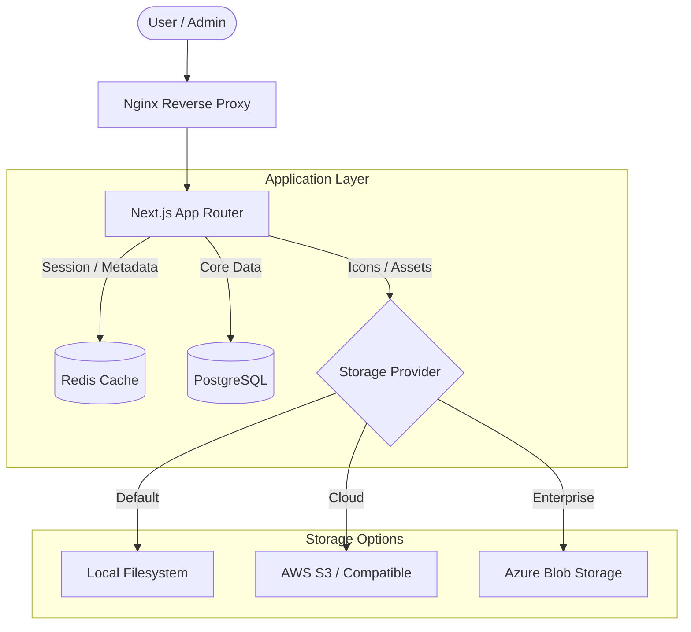

# TechHub Architecture

TechHub is a consolidated application portal designed for high availability, security, and scalability. It leverages a modern web stack with decoupled components to ensure seamless management of internal applications.

## System Overview

The following diagram illustrates the high-level flow of requests and data within the TechHub environment.

## Core Components

### 1. Reverse Proxy (Nginx)
The Nginx proxy serves as the entry point, handling:
- **TLS Termination**: Secure HTTPS communication.
- **Security Headers**: HSTS, Content Security Policy (CSP), and Frame Options.
- **Request Routing**: Directing traffic to the Next.js application container.
- **Logging**: Capturing access and error logs for auditing.

### 2. Application Layer (Next.js)
Built with the Next.js App Router, the application handles:
- **Server Components**: Optimized data fetching and rendering.
- **Server Actions**: Secure form submissions and administrative tasks.
- **Authentication**: Integrated via NextAuth.js (supporting SSO and Local Credentials).

### 3. Caching Layer (Redis)
Redis is utilized for:
- **Session Metadata**: Faster session lookups and reduced database load.
- **Rate Limiting**: Centralized tracking of request frequency across multiple app instances.
- **Consistency**: Ensuring users have immediate access to updated roles and permissions.

### 4. Database (PostgreSQL)
The primary source of truth for:
- **User Profiles**: Names, emails, and role assignments.
- **App Catalogue**: Links, categories, and descriptions.
- **Audit Logs**: A permanent record of all admin and security events.

### 5. Decoupled Storage
TechHub supports a flexible storage architecture for application icons:
- **Abstraction**: A unified interface (`src/lib/storage.ts`) masks the complexity of different providers.
- **Providers**: Supports Local storage (default for small setups), AWS S3 (for cloud scale), and Azure Blob Storage (for enterprise environments).
- **Cleanup**: Built-in tools reach out to the active provider to purge orphaned files, keeping storage costs lean.
