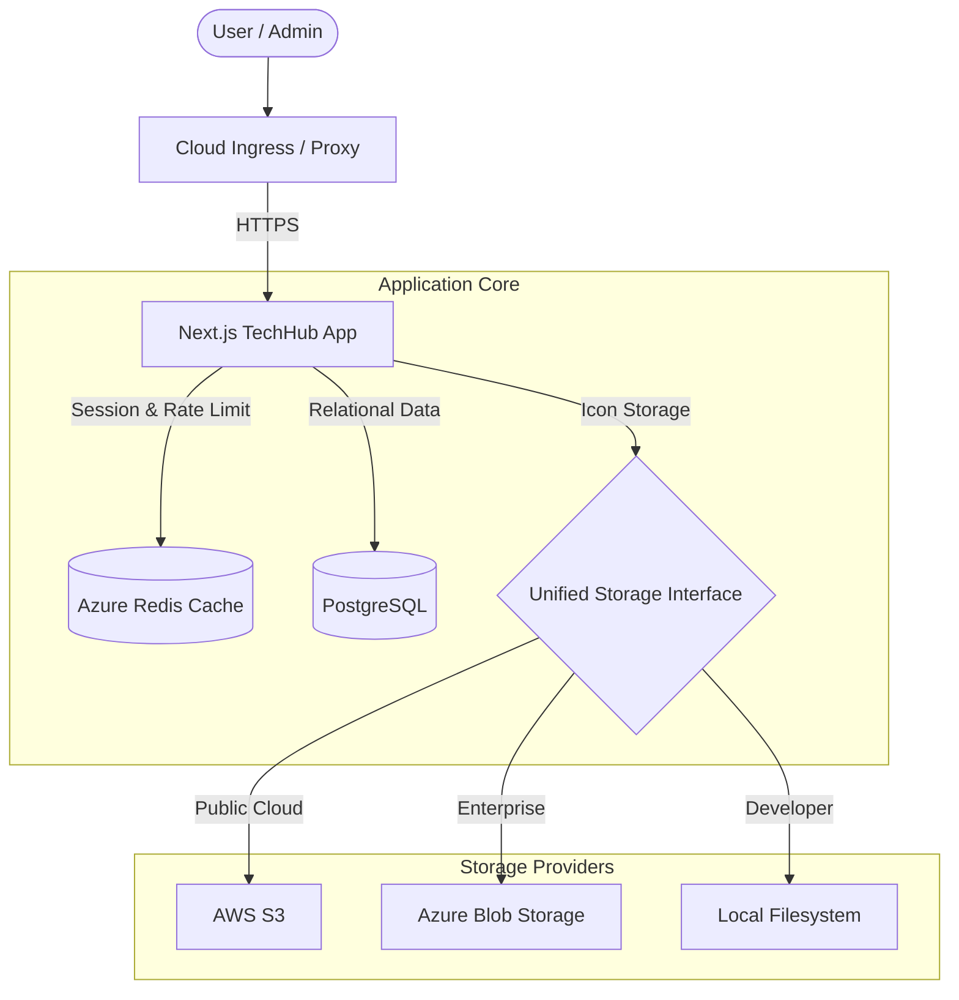

# TechHub Architecture

TechHub is a high-performance, secure application portal designed for enterprise environments. It follows a **Standalone Container** architecture, consolidating its request pipeline, security enforcement, and data orchestration into a single, scalable unit.

## 1. System Overview

TechHub leverages a modern web stack to balance development velocity with robust security.

## 2. Component Breakdown

### Infrastructure Layer
- **Standalone Container**: The application is built as a self-contained unit using the `node:20-slim` base image. It is optimized for **Azure Container Apps** and standard Kubernetes environments.
- **Middleware Pipeline**: A high-performance request interceptor (`src/middleware.ts`) that handles:
  - **Security Headers**: Injecting Nonce-based CSP, HSTS, and Frame protection.
  - **Session Guards**: Enforcing idle/absolute timeouts and revocation.
  - **CSRF Token Generation**: Injecting signed HMAC tokens.

### Application Layer (`src/app`)
- **App Router**: Uses Next.js 15 App Router for optimized server-side rendering (SSR) and streaming.
- **Server Actions**: All mutations (e.g., updating user profiles, adding apps) are handled via safe Server Actions that enforce RBAC and CSRF protection natively.
- **Admin Module**: A dedicated area for managing the catalogue, user roles, SSO configuration, and system health.

### Logic & Security Layer (`src/lib`)
- **`auth.ts`**: The core authentication engine using Next-Auth. Handles credential validation, SSO provider mapping, and JWT consistency checks.
- **`security/`**: A suite of specialized utilities:
  - `csrf.ts`: HMAC-signed token validation.
  - `ssrf.ts`: Resolve-time DNS validation to prevent internal network scanning.
  - `crypto.ts`: Envelope encryption for storing cloud secrets in the database.
- **`storage.ts`**: An abstraction layer that provides a consistent API for reading and writing icons regardless of the underlying cloud provider.

## 3. Data Lifecycle

### Authentication Flow
1. **Initiation**: User hits `/auth/signin`.
2. **Provider Redirect**: Handled via Next-Auth (Azure AD, Keycloak, or Credentials).
3. **JWT Issue**: On success, a JWT is issued with an **Absolute Lifetime** (8 hours).
4. **Session Guard**: Every subsequent request is checked against a **Redis-backed Idle Timer** (20 minutes).
5. **Revocation**: If a user is deleted or their password changed elsewhere, the `jwt` callback detects the update and revokes the session in real-time.

### Request Flow
1. **Middleware**: Headers are set, and the session is validated.
2. **Page Load**: Next.js fetches meta-data from Redis (roles, profile pic) to avoid DB overhead.
3. **App Rendering**: The catalogue is rendered based on the user's specific roles and audience permissions.
4. **Feedback**: Audit logs are generated for all state changes (`writeAuditLog`).

## 4. Key Dependencies

| Dependency | Purpose |
| :--- | :--- |
| **Next.js** | Core framework for SSR and API routes. |
| **Prisma** | Type-safe ORM for PostgreSQL. |
| **Next-Auth** | Authentication and session management. |
| **Redis (ioredis)** | Distributed caching and rate limiting. |
| **Zod** | End-to-end schema validation. |
| **Lucide React** | Consistent, high-quality iconography. |
| **ipaddr.js** | Precise IP/CIDR validation for proxy trust logic. |
