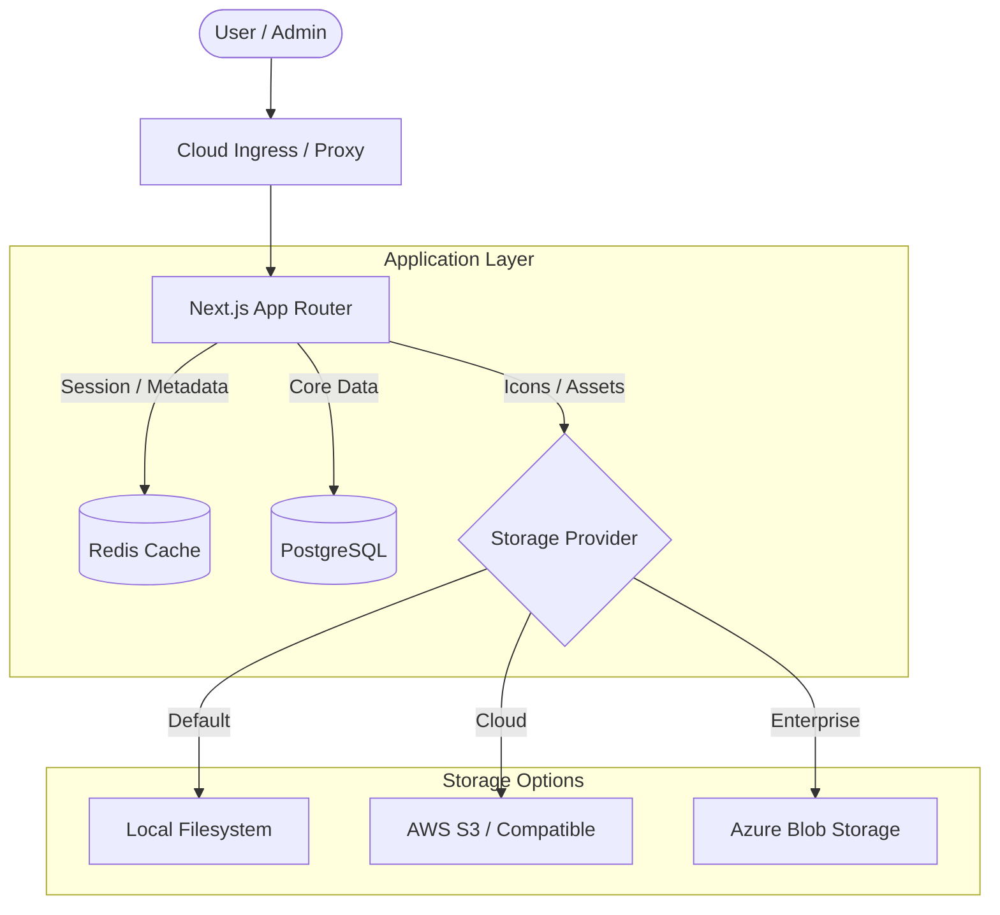

# TechHub Architecture

TechHub is a consolidated application portal designed for high availability, security, and scalability. It leverages a modern web stack with a **Standalone Container** architecture to ensure seamless management of internal applications.

## System Overview

The following diagram illustrates the high-level flow of requests and data within the TechHub environment.

## Core Components

### 1. Ingress Layer
TechHub is designed to be deployed behind a modern Cloud Ingress or Reverse Proxy (e.g., Azure Container Apps Ingress, Azure Front Door, AWS ALB, or Nginx). Unlike older architectures that required an Nginx "sidecar" inside the container orchestration, TechHub is a **Standalone Container** that handles its own security headers and logic. The Ingress layer now focuses primarily on:
- **TLS Termination**: Secure HTTPS communication.
- **Global Path Routing**: Directing traffic to the TechHub container on Port 3000.
- **Load Balancing**: Distributing traffic across multiple instances.

### 2. Application Layer (Next.js Standalone)
The core of TechHub is a self-contained Next.js application. It is fully hardened at the application layer:
- **Self-Managed Security**: HSTS, CSP, and X-Frame-Options are managed directly in the application middleware.
- **Strict Content Security Policy**: Uses dynamic nonces to allow scripts and styles while blocking all unauthorized inline code.
- **Resource Efficiency**: Optimized for container runtimes with a stabilized internal port (3000).

### 3. Caching Layer (Redis)
Redis is critical for high-concurrency environments:
- **Session Metadata**: Faster session lookups and reduced database load.
- **Rate Limiting**: Centralized tracking of request frequency across multiple app instances.
- **Consistency**: Ensuring users have immediate access to updated roles and permissions.

### 4. Database (PostgreSQL)
The primary source of truth for:
- **User Profiles**: Names, emails, and role assignments.
- **App Catalogue**: Links, categories, and descriptions.
- **Audit Logs**: A permanent record of all admin and security events.

### 5. Decoupled Storage
TechHub supports a flexible storage architecture for application icons:
- **Abstraction**: A unified interface (`src/lib/storage.ts`) masks the complexity of different providers.
- **Providers**: Supports Local storage (default for small setups), AWS S3 (for cloud scale), and Azure Blob Storage (for enterprise environments).
- **Cleanup**: Built-in tools reach out to the active provider to purge orphaned files, keeping storage costs lean.
